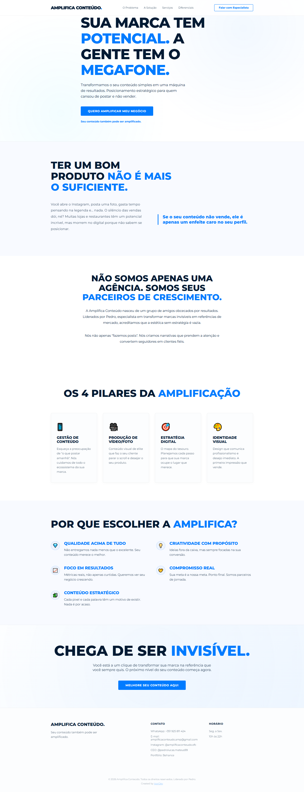

# Amplifica Conteúdo - Portfólio

Landing Page de alta conversão desenvolvida para a marca **Amplifica Conteúdo**, liderada por Pedro Lucas. O projeto foca em uma estética moderna de agência, com animações fluidas, design responsivo e foco total em resultados de marketing digital.

---

## 📸 Preview do Projeto

---

## 🚀 Tecnologias Utilizadas

- **React + TypeScript:** Estrutura robusta e tipagem segura.
- **Vite:** Build ultra-rápido e performance otimizada.
- **Vanilla CSS:** Estilização modular e animações personalizadas.
- **Intersection Observer API:** Animações de entrada e revelação no scroll.
- **Google Analytics & Microsoft Clarity:** Monitoramento de tráfego e comportamento do usuário.
- **SEO Otimizado:** Meta tags configuradas para melhor ranqueamento e compartilhamento social.

---

## 🛠️ Funcionalidades

- [x] **Design Responsivo:** Adaptado para Mobile, Tablet e Desktop.
- [x] **Light Mode:** Estética limpa em variações de azul e branco sólido.
- [x] **Integração Social:** Links diretos para WhatsApp, Instagram e Behance.
- [x] **Animações Fluidas:** Efeitos de fade-in, slide-up e scale-up conforme a navegação.
- [x] **Build de Produção:** Deploy automatizado via Netlify.

---

## 🔗 Links Úteis

- **Site Ao Vivo:** [https://amplifica-conteudo.netlify.app](https://amplifica-conteudo.netlify.app)
- **LinkedIn do Desenvolvedor:** [IgorDev Portfolio](https://igordev-portfolio-ofc.netlify.app/)

---

## 👤 Desenvolvedor

Este projeto foi desenvolvido por **IgorDev**. Sinta-se à vontade para entrar em contato através do meu [Portfólio](https://igordev-portfolio-ofc.netlify.app/).

---

© 2026 Amplifica Conteúdo. Todos os direitos reservados.
